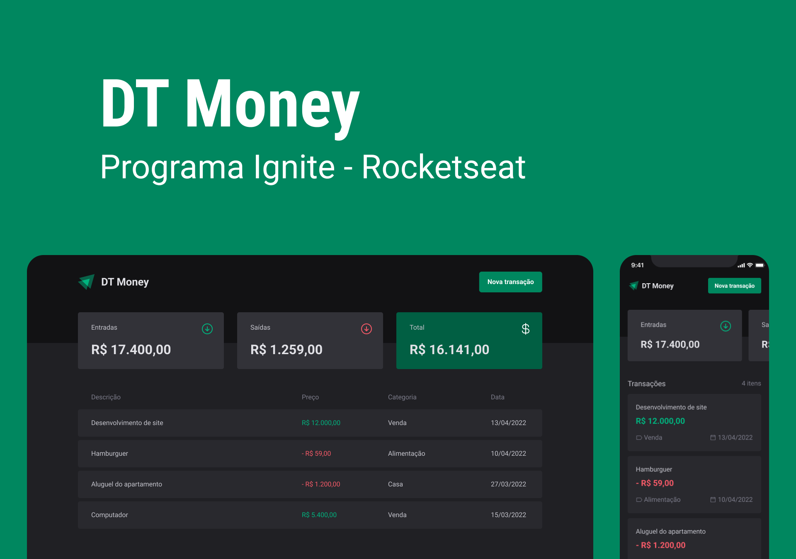

# DT Money

DT Money é uma aplicação web para controle de finanças pessoais, desenvolvida com ReactJS e integração com API.


## Funcionalidades

- Adicionar e remover transações
- Visualizar o saldo atual
- Visualizar o histórico de transações

## Instalação

Clone o repositório: git clone https://github.com/bsvleste/dt-money.git

```bash
    Acesse a pasta do projeto: cd dt-money
    Instale as dependências: npm install
    Inicie a aplicação: npm start
```
## Servidor offline
````bash
    execute npm run dev:server
    o servidor ira rodar na porta 3333
````
## Tecnologias utilizadas

- ReactJS
- TypeScript
- Styled Components
- Json server
## Design  Completo do projeto 
[Figma - dt money](https://www.figma.com/file/EJZVPSghuSsFvqO5aFwg0g/DT-Money-(Community)?node-id=0%3A1&t=vaxjru4JQcAmryvE-0)